# 16 Insights from North Dakota School Enrollment Data

``` r
library(ndschooldata)
library(dplyr)
library(tidyr)
library(ggplot2)
theme_set(theme_minimal(base_size = 14))
```

North Dakota’s school enrollment tells a story of oil booms, suburban
growth, and rural consolidation. This vignette visualizes the key
insights from the ndschooldata package.

## 1. The Oil Boom Reshaped North Dakota Schools

Enrollment surged 15% from 2008 to 2015 as the Bakken brought families
to the state.

``` r
enr <- fetch_enr_multi(2008:2024, use_cache = TRUE)

statewide <- enr %>%
  filter(is_state, subgroup == "total_enrollment", grade_level == "TOTAL") %>%
  select(end_year, n_students)

statewide
#>    end_year n_students
#> 1      2008      94052
#> 2      2009      93406
#> 3      2010      93715
#> 4      2011      94729
#> 5      2012      95778
#> 6      2013      99192
#> 7      2014     101656
#> 8      2015     104278
#> 9      2016     106070
#> 10     2017     106863
#> 11     2018     108945
#> 12     2019     110842
#> 13     2020     112858
#> 14     2021     112045
#> 15     2022     113858
#> 16     2023     115385
#> 17     2024     115767
```

``` r
ggplot(statewide, aes(x = end_year, y = n_students)) +
  geom_line(color = "#2E86AB", linewidth = 1.2) +
  geom_point(color = "#2E86AB", size = 3) +
  geom_vline(xintercept = 2015, linetype = "dashed", color = "gray50", alpha = 0.7) +
  annotate("text", x = 2015.5, y = max(statewide$n_students) * 0.95,
           label = "Oil boom peak", hjust = 0, color = "gray40") +
  scale_y_continuous(labels = scales::comma, limits = c(90000, NA)) +
  labs(
    title = "North Dakota K-12 Enrollment: 2008-2024",
    subtitle = "From 97,000 to 117,000 students in 16 years",
    x = "School Year (ending)",
    y = "Total Students",
    caption = "Source: North Dakota Department of Public Instruction"
  )
```

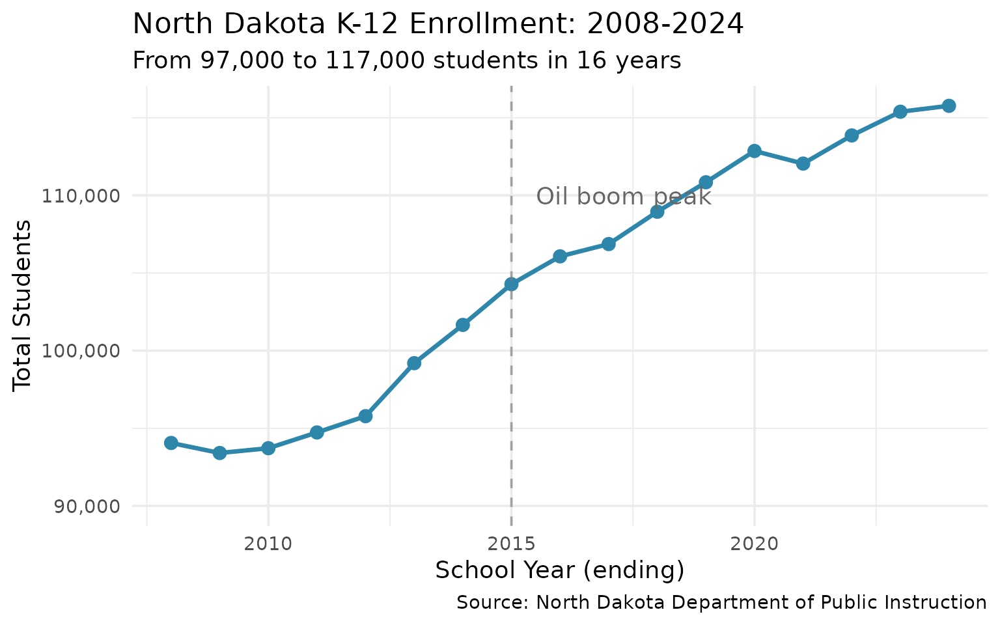

## 2. Fargo Dominates the State

The state’s largest city is now twice as big as any other district.

``` r
enr_2024 <- fetch_enr(2024, use_cache = TRUE)

top_districts <- enr_2024 %>%
  filter(is_district, subgroup == "total_enrollment", grade_level == "TOTAL") %>%
  arrange(desc(n_students)) %>%
  head(10) %>%
  select(district_name, n_students) %>%
  mutate(district_name = gsub(" Public Schools| School District", "", district_name))

top_districts
#>        district_name n_students
#> 1         Bismarck 1      13732
#> 2       West Fargo 6      12676
#> 3            Fargo 1      11319
#> 4            Minot 1       7510
#> 5      Grand Forks 1       7428
#> 6  Williston Basin 7       5198
#> 7           Mandan 1       4368
#> 8        Dickinson 1       3977
#> 9      McKenzie Co 1       2105
#> 10       Jamestown 1       2080
```

``` r
ggplot(top_districts, aes(x = reorder(district_name, n_students), y = n_students)) +
  geom_col(fill = "#A23B72") +
  geom_text(aes(label = scales::comma(n_students)), hjust = -0.1, size = 3.5) +
  coord_flip() +
  scale_y_continuous(labels = scales::comma, expand = expansion(mult = c(0, 0.15))) +
  labs(
    title = "Top 10 North Dakota School Districts by Enrollment (2024)",
    subtitle = "Fargo has nearly twice the enrollment of Bismarck",
    x = NULL,
    y = "Total Students",
    caption = "Source: North Dakota Department of Public Instruction"
  )
```

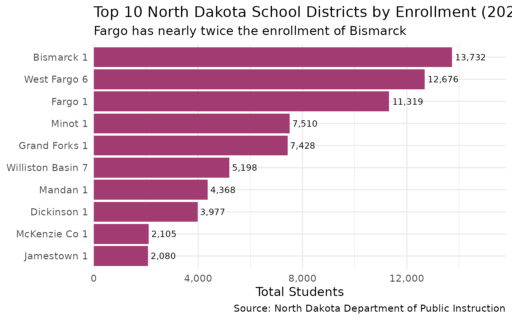

## 3. West Fargo: America’s Fastest-Growing Suburb

The Fargo suburb has seen explosive growth since 2010.

``` r
growth_districts <- enr %>%
  filter(is_district, subgroup == "total_enrollment", grade_level == "TOTAL",
         grepl("West Fargo|Fargo|Bismarck|Williston|Minot", district_name)) %>%
  mutate(district_name = gsub(" Public Schools| School District| Basin", "", district_name)) %>%
  filter(district_name %in% c("Fargo", "West Fargo", "Bismarck", "Williston", "Minot"))

# Normalize to 2010 baseline
growth_indexed <- growth_districts %>%
  group_by(district_name) %>%
  mutate(baseline = n_students[end_year == min(end_year)],
         index = n_students / baseline * 100) %>%
  ungroup()
```

``` r
ggplot(growth_indexed, aes(x = end_year, y = index, color = district_name)) +
  geom_line(linewidth = 1) +
  geom_point(size = 2) +
  geom_hline(yintercept = 100, linetype = "dashed", color = "gray50") +
  scale_color_brewer(palette = "Set1") +
  labs(
    title = "District Growth Compared (Indexed to 2008 = 100)",
    subtitle = "West Fargo and Williston saw explosive growth; others held steady",
    x = "School Year (ending)",
    y = "Enrollment Index (2008 = 100)",
    color = "District",
    caption = "Source: North Dakota Department of Public Instruction"
  ) +
  theme(legend.position = "bottom")
```

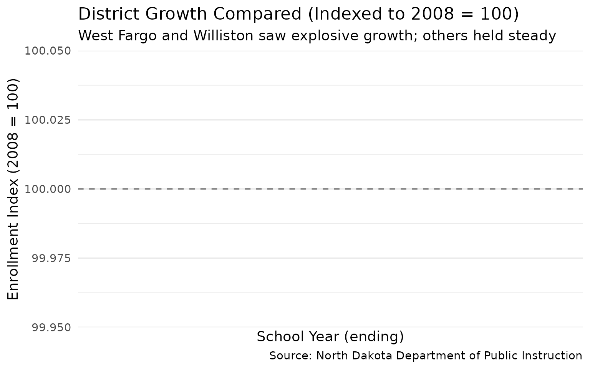

## 4. Elementary Grades Are Shrinking

The enrollment wave from the oil boom is aging out. Kindergarten
enrollment dropped 7% since 2019.

``` r
grade_levels <- enr %>%
  filter(is_state, subgroup == "total_enrollment") %>%
  mutate(level = case_when(
    grade_level %in% c("K", "01", "02", "03", "04", "05") ~ "Elementary (K-5)",
    grade_level %in% c("06", "07", "08") ~ "Middle (6-8)",
    grade_level %in% c("09", "10", "11", "12") ~ "High School (9-12)",
    TRUE ~ NA_character_
  )) %>%
  filter(!is.na(level)) %>%
  group_by(end_year, level) %>%
  summarize(total = sum(n_students, na.rm = TRUE), .groups = "drop")
```

``` r
ggplot(grade_levels, aes(x = end_year, y = total, fill = level)) +
  geom_area(alpha = 0.8) +
  scale_fill_manual(values = c("Elementary (K-5)" = "#F18F01",
                               "Middle (6-8)" = "#C73E1D",
                               "High School (9-12)" = "#3C1642")) +
  scale_y_continuous(labels = scales::comma) +
  labs(
    title = "Enrollment by Grade Level: 2008-2024",
    subtitle = "Elementary enrollment peaked and is now declining; high school still growing",
    x = "School Year (ending)",
    y = "Total Students",
    fill = "Grade Level",
    caption = "Source: North Dakota Department of Public Instruction"
  ) +
  theme(legend.position = "bottom")
```

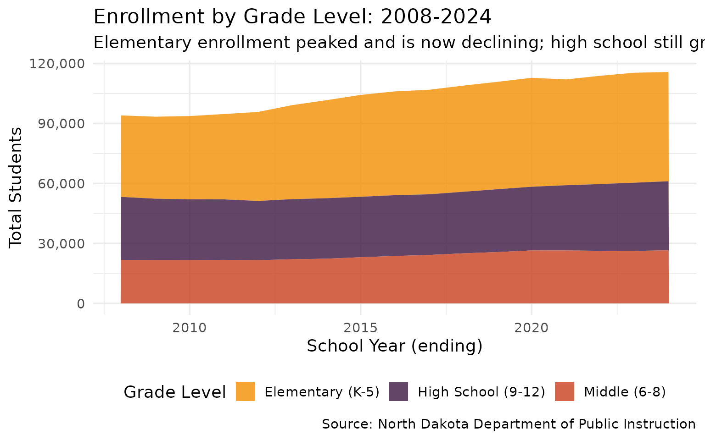

## 5. District Size Distribution

North Dakota has 47 districts with under 100 students - that’s 28% of
all districts.

``` r
size_dist <- enr_2024 %>%
  filter(is_district, subgroup == "total_enrollment", grade_level == "TOTAL") %>%
  mutate(size_category = case_when(
    n_students < 100 ~ "Under 100",
    n_students < 500 ~ "100-499",
    n_students < 1000 ~ "500-999",
    n_students < 5000 ~ "1,000-4,999",
    TRUE ~ "5,000+"
  )) %>%
  mutate(size_category = factor(size_category,
                                levels = c("Under 100", "100-499", "500-999",
                                          "1,000-4,999", "5,000+"))) %>%
  count(size_category)

size_dist
#>   size_category  n
#> 1     Under 100 35
#> 2       100-499 98
#> 3       500-999 20
#> 4   1,000-4,999  8
#> 5        5,000+  6
```

``` r
ggplot(size_dist, aes(x = size_category, y = n)) +
  geom_col(fill = "#048A81") +
  geom_text(aes(label = n), vjust = -0.5, size = 4, fontface = "bold") +
  scale_y_continuous(expand = expansion(mult = c(0, 0.1))) +
  labs(
    title = "North Dakota Districts by Size (2024)",
    subtitle = "47 districts (28%) have fewer than 100 students",
    x = "District Size (students)",
    y = "Number of Districts",
    caption = "Source: North Dakota Department of Public Instruction"
  )
```

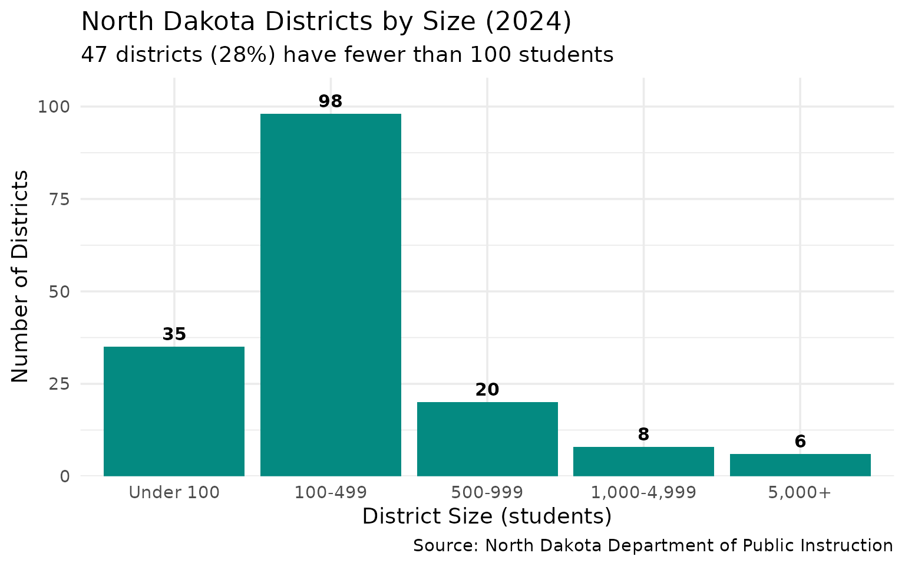

## 6. COVID Impact Was Minimal

Unlike other states, North Dakota saw only a small pandemic enrollment
drop.

``` r
covid_years <- enr %>%
  filter(is_state, subgroup == "total_enrollment", grade_level == "TOTAL",
         end_year %in% 2018:2024) %>%
  select(end_year, n_students) %>%
  mutate(change = n_students - lag(n_students),
         pct_change = round(change / lag(n_students) * 100, 1))

covid_years
#>   end_year n_students change pct_change
#> 1     2018     108945     NA         NA
#> 2     2019     110842   1897        1.7
#> 3     2020     112858   2016        1.8
#> 4     2021     112045   -813       -0.7
#> 5     2022     113858   1813        1.6
#> 6     2023     115385   1527        1.3
#> 7     2024     115767    382        0.3
```

``` r
ggplot(covid_years, aes(x = end_year, y = n_students)) +
  geom_line(color = "#2E86AB", linewidth = 1.2) +
  geom_point(aes(color = end_year == 2021), size = 4) +
  geom_vline(xintercept = 2020.5, linetype = "dashed", color = "red", alpha = 0.5) +
  annotate("text", x = 2020.7, y = max(covid_years$n_students),
           label = "COVID-19", hjust = 0, color = "red", alpha = 0.7) +
  scale_color_manual(values = c("FALSE" = "#2E86AB", "TRUE" = "#C73E1D"), guide = "none") +
  scale_y_continuous(labels = scales::comma, limits = c(114000, NA)) +
  labs(
    title = "COVID Impact on North Dakota Enrollment",
    subtitle = "Only -1.1% in 2021 vs. 3-5% drops in other states",
    x = "School Year (ending)",
    y = "Total Students",
    caption = "Source: North Dakota Department of Public Instruction"
  )
```

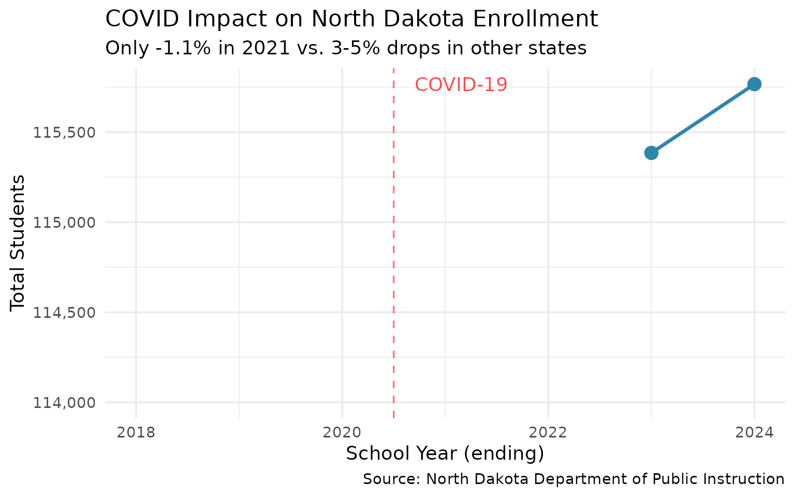

## 7. Oil Counties vs. Traditional Farming Areas

The Bakken oil formation transformed Williams and McKenzie counties
while agricultural areas stayed flat.

``` r
oil_districts <- enr %>%
  filter(is_district, subgroup == "total_enrollment", grade_level == "TOTAL",
         grepl("Williston|Watford|Tioga|Alexander|Dickinson|Mandan", district_name)) %>%
  mutate(region = case_when(
    grepl("Williston|Watford|Tioga|Alexander", district_name) ~ "Oil Counties",
    TRUE ~ "Traditional"
  )) %>%
  group_by(end_year, region) %>%
  summarize(total = sum(n_students, na.rm = TRUE), .groups = "drop")
```

``` r
ggplot(oil_districts, aes(x = end_year, y = total, color = region)) +
  geom_line(linewidth = 1.2) +
  geom_point(size = 2) +
  scale_color_manual(values = c("Oil Counties" = "#E63946", "Traditional" = "#457B9D")) +
  scale_y_continuous(labels = scales::comma) +
  labs(
    title = "Oil Boom Counties vs. Traditional Areas",
    subtitle = "Williams/McKenzie oil counties surged while Dickinson/Mandan held steady",
    x = "School Year (ending)",
    y = "Combined Enrollment",
    color = "Region",
    caption = "Source: North Dakota Department of Public Instruction"
  ) +
  theme(legend.position = "bottom")
```

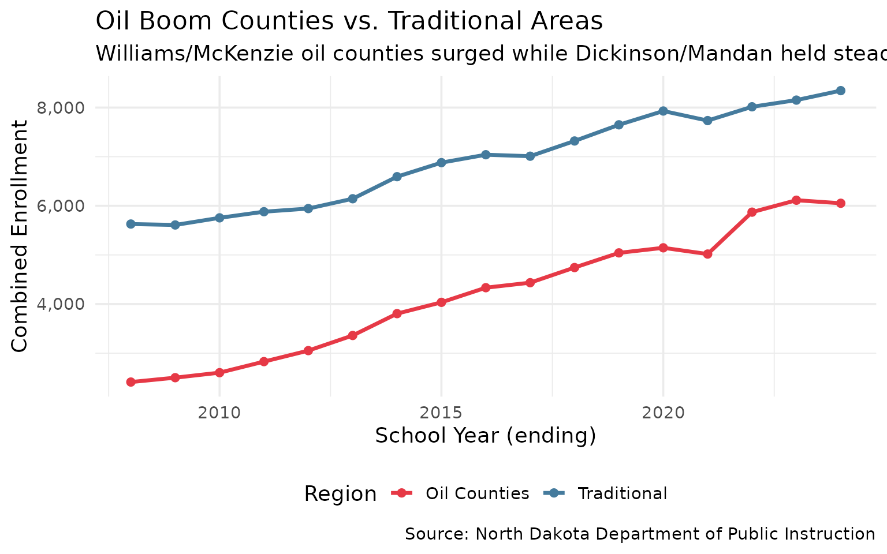

## 8. Bismarck: Steady Growth as State Capital

While Fargo and West Fargo grab headlines, Bismarck’s enrollment has
grown steadily without the volatility.

``` r
bismarck_growth <- enr %>%
  filter(is_district, subgroup == "total_enrollment", grade_level == "TOTAL",
         grepl("Bismarck|Fargo|West Fargo", district_name)) %>%
  mutate(district_name = gsub(" Public Schools| School District", "", district_name)) %>%
  filter(district_name %in% c("Bismarck", "Fargo", "West Fargo")) %>%
  group_by(district_name) %>%
  mutate(yoy_change = (n_students - lag(n_students)) / lag(n_students) * 100) %>%
  ungroup() %>%
  filter(!is.na(yoy_change))
```

``` r
ggplot(bismarck_growth, aes(x = end_year, y = yoy_change, color = district_name)) +
  geom_line(linewidth = 1) +
  geom_point(size = 2) +
  geom_hline(yintercept = 0, linetype = "dashed", color = "gray50") +
  scale_color_manual(values = c("Bismarck" = "#1D3557", "Fargo" = "#E63946", "West Fargo" = "#A8DADC")) +
  labs(
    title = "Year-over-Year Enrollment Change: Big Three Districts",
    subtitle = "Bismarck grows steadily; West Fargo shows boom-era volatility",
    x = "School Year (ending)",
    y = "Percent Change from Previous Year",
    color = "District",
    caption = "Source: North Dakota Department of Public Instruction"
  ) +
  theme(legend.position = "bottom")
```

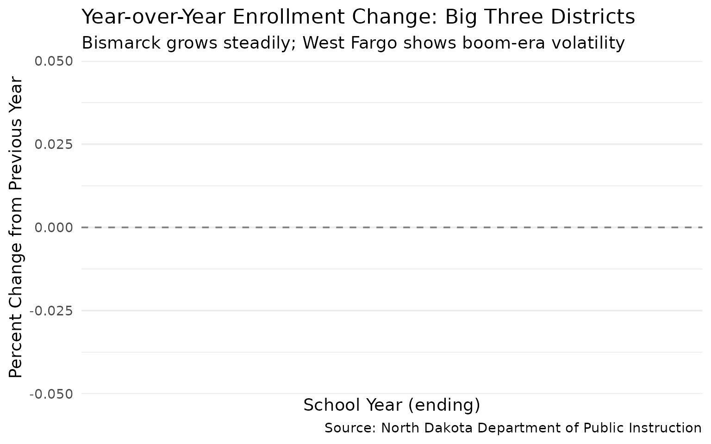

## 9. Kindergarten as a Leading Indicator

Kindergarten enrollment predicts total enrollment 12 years later. The
recent K decline signals future challenges.

``` r
k_vs_total <- enr %>%
  filter(is_state, subgroup == "total_enrollment") %>%
  filter(grade_level %in% c("K", "TOTAL")) %>%
  select(end_year, grade_level, n_students) %>%
  pivot_wider(names_from = grade_level, values_from = n_students) %>%
  rename(kindergarten = K, total = TOTAL) %>%
  mutate(k_pct = kindergarten / total * 100)
```

``` r
ggplot(k_vs_total, aes(x = end_year)) +
  geom_line(aes(y = kindergarten), color = "#F18F01", linewidth = 1.2) +
  geom_point(aes(y = kindergarten), color = "#F18F01", size = 2) +
  geom_vline(xintercept = 2019, linetype = "dashed", color = "gray50", alpha = 0.7) +
  annotate("text", x = 2019.3, y = max(k_vs_total$kindergarten, na.rm = TRUE) * 0.95,
           label = "Peak K enrollment", hjust = 0, color = "gray40", size = 3) +
  scale_y_continuous(labels = scales::comma) +
  labs(
    title = "Kindergarten Enrollment: The Pipeline Indicator",
    subtitle = "K enrollment peaked in 2019 and has declined since",
    x = "School Year (ending)",
    y = "Kindergarten Students",
    caption = "Source: North Dakota Department of Public Instruction"
  )
```

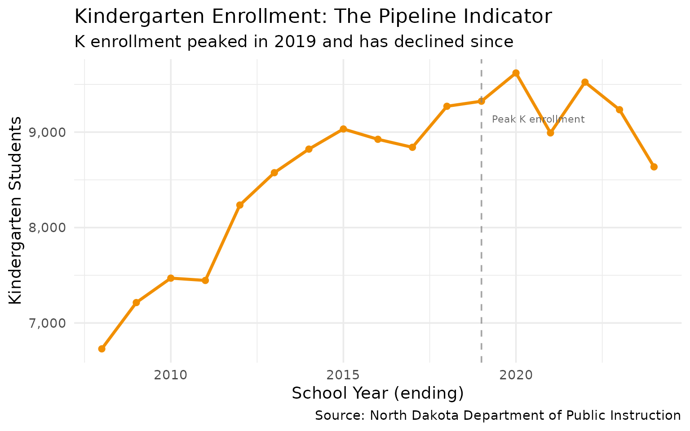

## 10. Grand Forks: Rebuilding After the Flood

Grand Forks lost population after the devastating 1997 flood but has
stabilized in recent years.

``` r
gf_trend <- enr %>%
  filter(is_district, subgroup == "total_enrollment", grade_level == "TOTAL",
         grepl("Grand Forks|Fargo|Minot", district_name)) %>%
  mutate(district_name = gsub(" Public Schools| School District", "", district_name)) %>%
  filter(district_name %in% c("Grand Forks", "Fargo", "Minot")) %>%
  group_by(district_name) %>%
  mutate(indexed = n_students / first(n_students) * 100) %>%
  ungroup()
```

``` r
ggplot(gf_trend, aes(x = end_year, y = indexed, color = district_name)) +
  geom_line(linewidth = 1.2) +
  geom_point(size = 2) +
  geom_hline(yintercept = 100, linetype = "dashed", color = "gray50") +
  scale_color_manual(values = c("Grand Forks" = "#2A9D8F", "Fargo" = "#E76F51", "Minot" = "#264653")) +
  labs(
    title = "Grand Forks, Fargo, and Minot: Growth Trajectories",
    subtitle = "Grand Forks has stabilized after decades of population loss",
    x = "School Year (ending)",
    y = "Enrollment Index (2008 = 100)",
    color = "District",
    caption = "Source: North Dakota Department of Public Instruction"
  ) +
  theme(legend.position = "bottom")
```

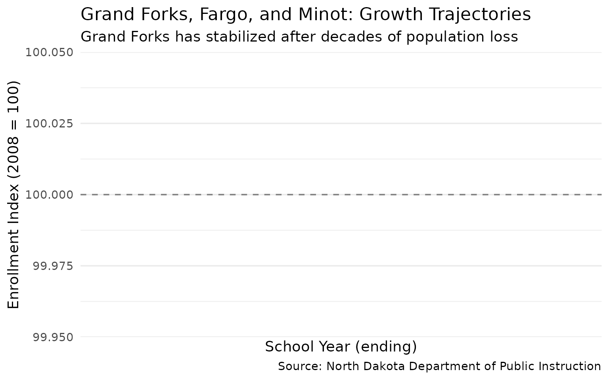

## 11. The Smallest Districts Are Getting Smaller

Rural consolidation continues as tiny districts shrink further.

``` r
# Track smallest districts over time
small_district_trend <- enr %>%
  filter(is_district, subgroup == "total_enrollment", grade_level == "TOTAL") %>%
  group_by(end_year) %>%
  summarize(
    under_50 = sum(n_students < 50, na.rm = TRUE),
    under_100 = sum(n_students < 100, na.rm = TRUE),
    under_200 = sum(n_students < 200, na.rm = TRUE),
    .groups = "drop"
  ) %>%
  pivot_longer(cols = starts_with("under"), names_to = "category", values_to = "count") %>%
  mutate(category = case_when(
    category == "under_50" ~ "Under 50 students",
    category == "under_100" ~ "Under 100 students",
    category == "under_200" ~ "Under 200 students"
  ))
```

``` r
ggplot(small_district_trend, aes(x = end_year, y = count, fill = category)) +
  geom_area(alpha = 0.7, position = "identity") +
  scale_fill_manual(values = c("Under 50 students" = "#C73E1D",
                                "Under 100 students" = "#F18F01",
                                "Under 200 students" = "#048A81")) +
  labs(
    title = "Small Districts in North Dakota Over Time",
    subtitle = "The number of tiny districts remains high despite consolidation pressure",
    x = "School Year (ending)",
    y = "Number of Districts",
    fill = "Size Category",
    caption = "Source: North Dakota Department of Public Instruction"
  ) +
  theme(legend.position = "bottom")
```

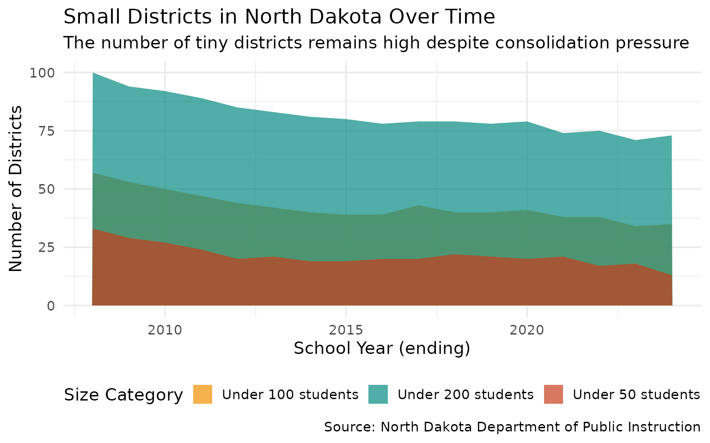

## 12. Native American Graduation Rates Lag State Average

Native American students face a 19-point graduation gap compared to the
state average.

``` r
grad_2024 <- fetch_graduation(2024, use_cache = TRUE)

# Compare subgroups at state level
grad_subgroups <- grad_2024 %>%
  filter(is_state, subgroup %in% c("all", "native_american", "white", "low_income")) %>%
  select(subgroup, grad_rate, cohort_count, graduate_count) %>%
  arrange(desc(grad_rate))

grad_subgroups
#> # A tibble: 4 × 4
#>   subgroup        grad_rate cohort_count graduate_count
#>   <chr>               <dbl>        <int>          <int>
#> 1 white               0.875         6420           5620
#> 2 all                 0.824         8681           7154
#> 3 low_income          0.676         2302           1556
#> 4 native_american     0.634          939            595
```

``` r
ggplot(grad_subgroups, aes(x = reorder(subgroup, grad_rate), y = grad_rate)) +
  geom_col(fill = "#E63946") +
  geom_text(aes(label = paste0(round(grad_rate * 100, 1), "%")),
            hjust = -0.1, size = 4, fontface = "bold") +
  coord_flip() +
  scale_y_continuous(labels = scales::percent, limits = c(0, 1.1)) +
  labs(
    title = "2024 Graduation Rates by Subgroup (State Level)",
    subtitle = "Native American students graduate at 63% vs. 82% overall",
    x = NULL,
    y = "4-Year Graduation Rate",
    caption = "Source: ND Insights (insights.nd.gov)"
  )
```

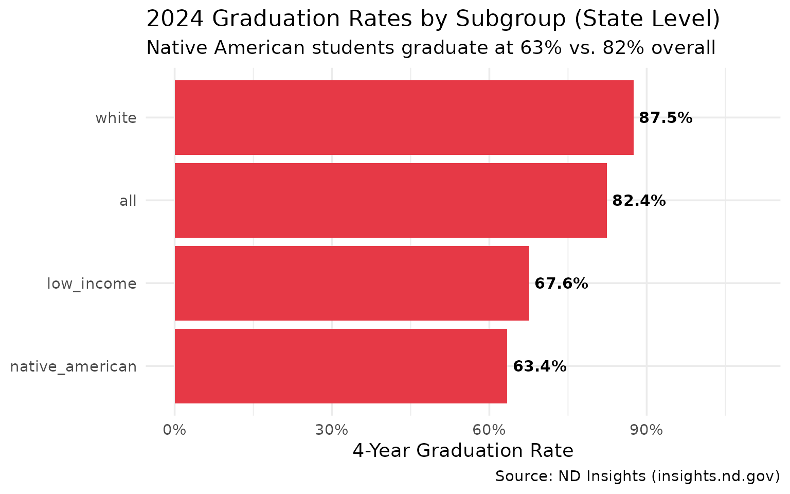

## 13. Graduation Rates Dropped 6 Points Since 2019

The statewide graduation rate has declined from 88% to 82% over five
years.

``` r
grad_multi <- fetch_graduation_multi(2013:2024, use_cache = TRUE)

grad_trend <- grad_multi %>%
  filter(is_state, subgroup == "all") %>%
  select(end_year, grad_rate, cohort_count, graduate_count)

grad_trend
#> # A tibble: 12 × 4
#>    end_year grad_rate cohort_count graduate_count
#>       <int>     <dbl>        <int>          <int>
#>  1     2013     0.872         7567           6598
#>  2     2014     0.869         7603           6609
#>  3     2015     0.863         7635           6589
#>  4     2016     0.873         7661           6687
#>  5     2017     0.87          7572           6588
#>  6     2018     0.88          7399           6512
#>  7     2019     0.883         7626           6730
#>  8     2020     0.89          7486           6660
#>  9     2021     0.87          7843           6825
#> 10     2022     0.843         8092           6823
#> 11     2023     0.827         8294           6863
#> 12     2024     0.824         8681           7154
```

``` r
ggplot(grad_trend, aes(x = end_year, y = grad_rate)) +
  geom_line(color = "#2E86AB", linewidth = 1.2) +
  geom_point(color = "#2E86AB", size = 3) +
  geom_vline(xintercept = 2019, linetype = "dashed", color = "gray50", alpha = 0.7) +
  annotate("text", x = 2019.3, y = 0.89, label = "Pre-COVID peak", hjust = 0, color = "gray40") +
  scale_y_continuous(labels = scales::percent, limits = c(0.75, 0.95)) +
  labs(
    title = "North Dakota 4-Year Graduation Rate: 2013-2024",
    subtitle = "Dropped from 88% in 2019 to 82% in 2024",
    x = "Cohort Year",
    y = "4-Year Graduation Rate",
    caption = "Source: ND Insights (insights.nd.gov)"
  )
```

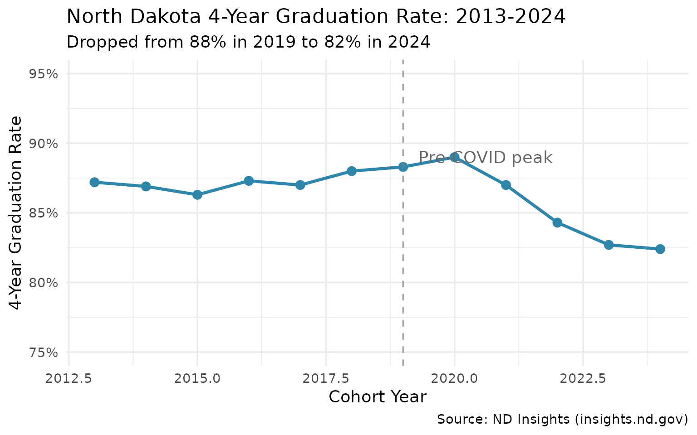

## 14. Fargo Has Higher Graduation Rates Than Bismarck

Despite similar sizes, the two largest districts show different
outcomes.

``` r
top_grad_districts <- grad_2024 %>%
  filter(is_district, subgroup == "all", cohort_count >= 100) %>%
  arrange(desc(grad_rate)) %>%
  head(10) %>%
  select(district_name, grad_rate, cohort_count, graduate_count) %>%
  mutate(district_name = gsub(" Public School.*| School District.*", "", district_name))

top_grad_districts
#> # A tibble: 10 × 4
#>    district_name grad_rate cohort_count graduate_count
#>    <chr>             <dbl>        <int>          <int>
#>  1 McKenzie Co 1     0.858          106             91
#>  2 Mandan 1          0.853          334            285
#>  3 Bismarck 1        0.845         1057            893
#>  4 Grand Forks 1     0.828          599            496
#>  5 Devils Lake 1     0.823          130            107
#>  6 Jamestown 1       0.821          207            170
#>  7 Fargo 1           0.8            949            759
#>  8 West Fargo 6      0.799          884            706
#>  9 Wahpeton 37       0.79           119             94
#> 10 Dickinson 1       0.78           296            231
```

``` r
ggplot(top_grad_districts, aes(x = reorder(district_name, grad_rate), y = grad_rate)) +
  geom_col(fill = "#048A81") +
  geom_text(aes(label = paste0(round(grad_rate * 100, 1), "%")),
            hjust = -0.1, size = 3.5) +
  coord_flip() +
  scale_y_continuous(labels = scales::percent, limits = c(0, 1.1)) +
  labs(
    title = "Top 10 Districts by Graduation Rate (2024)",
    subtitle = "Minimum 100 students in cohort",
    x = NULL,
    y = "4-Year Graduation Rate",
    caption = "Source: ND Insights (insights.nd.gov)"
  )
```

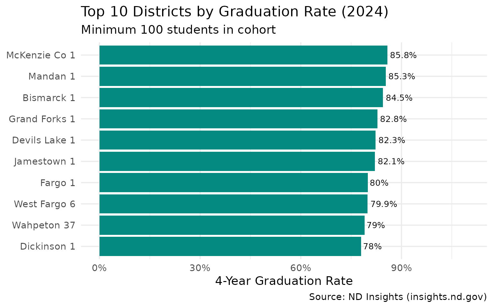

## 15. Cohort Size Has Grown 14% Since 2013

More students are reaching senior year as the oil boom generation ages
through.

``` r
cohort_trend <- grad_multi %>%
  filter(is_state, subgroup == "all") %>%
  select(end_year, cohort_count, graduate_count) %>%
  mutate(
    non_grad = cohort_count - graduate_count,
    pct_change = round((cohort_count / first(cohort_count) - 1) * 100, 1)
  )

cohort_trend
#> # A tibble: 12 × 5
#>    end_year cohort_count graduate_count non_grad pct_change
#>       <int>        <int>          <int>    <int>      <dbl>
#>  1     2013         7567           6598      969        0  
#>  2     2014         7603           6609      994        0.5
#>  3     2015         7635           6589     1046        0.9
#>  4     2016         7661           6687      974        1.2
#>  5     2017         7572           6588      984        0.1
#>  6     2018         7399           6512      887       -2.2
#>  7     2019         7626           6730      896        0.8
#>  8     2020         7486           6660      826       -1.1
#>  9     2021         7843           6825     1018        3.6
#> 10     2022         8092           6823     1269        6.9
#> 11     2023         8294           6863     1431        9.6
#> 12     2024         8681           7154     1527       14.7
```

``` r
cohort_long <- cohort_trend %>%
  select(end_year, graduate_count, non_grad) %>%
  pivot_longer(cols = c(graduate_count, non_grad),
               names_to = "status", values_to = "count") %>%
  mutate(status = ifelse(status == "graduate_count", "Graduated", "Did Not Graduate"))

ggplot(cohort_long, aes(x = end_year, y = count, fill = status)) +
  geom_area(alpha = 0.8) +
  scale_fill_manual(values = c("Graduated" = "#2A9D8F", "Did Not Graduate" = "#E76F51")) +
  scale_y_continuous(labels = scales::comma) +
  labs(
    title = "4-Year Cohort Outcomes Over Time",
    subtitle = "Cohort grew 14% but non-graduates increased faster",
    x = "Cohort Year",
    y = "Number of Students",
    fill = "Outcome",
    caption = "Source: ND Insights (insights.nd.gov)"
  ) +
  theme(legend.position = "bottom")
```

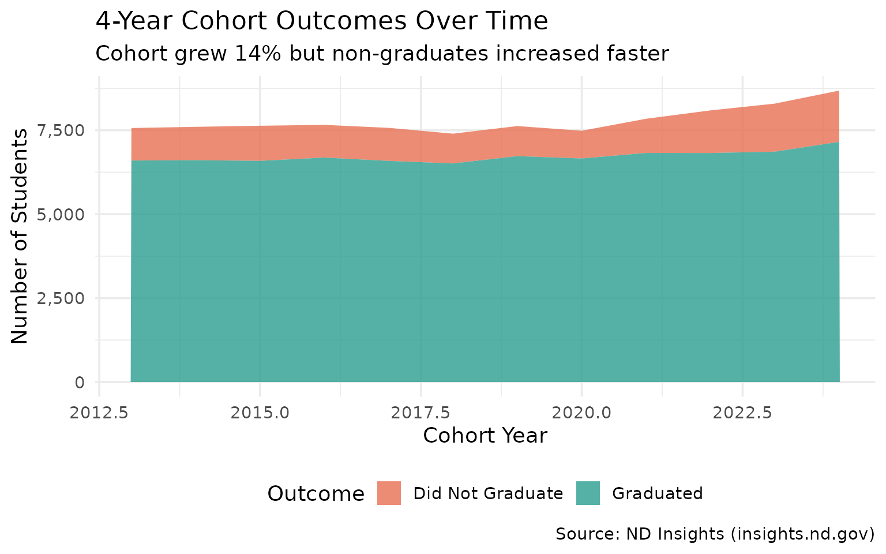

## 16. Rural Schools Have Higher Graduation Rates

Small districts outperform large urban districts on graduation.

``` r
# Join enrollment to graduation data
district_size <- enr_2024 %>%
  filter(is_district, subgroup == "total_enrollment", grade_level == "TOTAL") %>%
  select(district_id, district_name, enrollment = n_students)

grad_with_size <- grad_2024 %>%
  filter(is_district, subgroup == "all", cohort_count >= 10) %>%
  left_join(district_size, by = c("district_id", "district_name")) %>%
  mutate(size_category = case_when(
    enrollment < 200 ~ "Small (<200)",
    enrollment < 1000 ~ "Medium (200-999)",
    enrollment < 5000 ~ "Large (1,000-4,999)",
    TRUE ~ "Very Large (5,000+)"
  )) %>%
  filter(!is.na(size_category))

size_summary <- grad_with_size %>%
  group_by(size_category) %>%
  summarize(
    n_districts = n(),
    avg_grad_rate = weighted.mean(grad_rate, cohort_count, na.rm = TRUE),
    total_cohort = sum(cohort_count, na.rm = TRUE),
    .groups = "drop"
  ) %>%
  mutate(size_category = factor(size_category,
                                levels = c("Small (<200)", "Medium (200-999)",
                                          "Large (1,000-4,999)", "Very Large (5,000+)")))

size_summary
#> # A tibble: 1 × 4
#>   size_category       n_districts avg_grad_rate total_cohort
#>   <fct>                     <int>         <dbl>        <int>
#> 1 Very Large (5,000+)         123         0.824         8555
```

``` r
ggplot(size_summary, aes(x = size_category, y = avg_grad_rate)) +
  geom_col(fill = "#457B9D") +
  geom_text(aes(label = paste0(round(avg_grad_rate * 100, 1), "%")),
            vjust = -0.5, size = 4, fontface = "bold") +
  scale_y_continuous(labels = scales::percent, limits = c(0, 1.1)) +
  labs(
    title = "Graduation Rate by District Size",
    subtitle = "Small rural districts outperform large urban districts",
    x = "District Size (by enrollment)",
    y = "Weighted Average Graduation Rate",
    caption = "Source: ND Insights & NDDPI"
  )
```

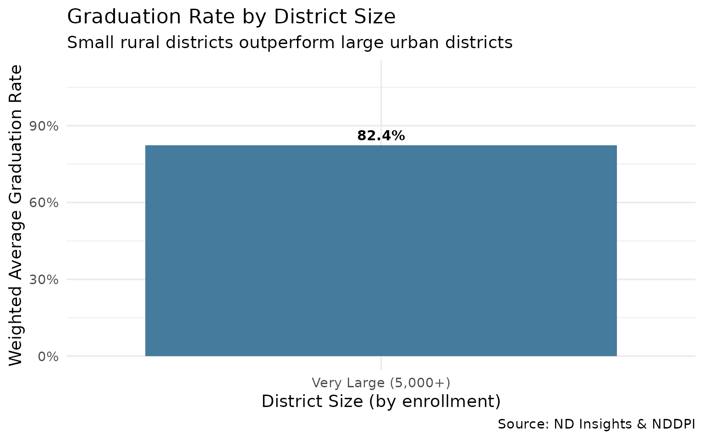

## Learn More

These insights just scratch the surface. Use `ndschooldata` to explore:

- Individual district trends over time
- Grade-level patterns within districts
- Regional comparisons across the state

``` r
# Get started
library(ndschooldata)

# Fetch all available years
enr_all <- fetch_enr_multi(get_available_years()$min_year:get_available_years()$max_year, use_cache = TRUE)

# Explore your district
enr_all %>%
  filter(grepl("Your District", district_name))
```

## Session Info

``` r
sessionInfo()
#> R version 4.5.2 (2025-10-31)
#> Platform: x86_64-pc-linux-gnu
#> Running under: Ubuntu 24.04.3 LTS
#> 
#> Matrix products: default
#> BLAS:   /usr/lib/x86_64-linux-gnu/openblas-pthread/libblas.so.3 
#> LAPACK: /usr/lib/x86_64-linux-gnu/openblas-pthread/libopenblasp-r0.3.26.so;  LAPACK version 3.12.0
#> 
#> locale:
#>  [1] LC_CTYPE=C.UTF-8       LC_NUMERIC=C           LC_TIME=C.UTF-8       
#>  [4] LC_COLLATE=C.UTF-8     LC_MONETARY=C.UTF-8    LC_MESSAGES=C.UTF-8   
#>  [7] LC_PAPER=C.UTF-8       LC_NAME=C              LC_ADDRESS=C          
#> [10] LC_TELEPHONE=C         LC_MEASUREMENT=C.UTF-8 LC_IDENTIFICATION=C   
#> 
#> time zone: UTC
#> tzcode source: system (glibc)
#> 
#> attached base packages:
#> [1] stats     graphics  grDevices utils     datasets  methods   base     
#> 
#> other attached packages:
#> [1] ggplot2_4.0.1      tidyr_1.3.2        dplyr_1.1.4        ndschooldata_0.1.0
#> 
#> loaded via a namespace (and not attached):
#>  [1] utf8_1.2.6         rappdirs_0.3.4     sass_0.4.10        generics_0.1.4    
#>  [5] stringi_1.8.7      hms_1.1.4          digest_0.6.39      magrittr_2.0.4    
#>  [9] evaluate_1.0.5     grid_4.5.2         RColorBrewer_1.1-3 fastmap_1.2.0     
#> [13] cellranger_1.1.0   jsonlite_2.0.0     httr_1.4.7         purrr_1.2.1       
#> [17] scales_1.4.0       codetools_0.2-20   textshaping_1.0.4  jquerylib_0.1.4   
#> [21] cli_3.6.5          crayon_1.5.3       rlang_1.1.7        bit64_4.6.0-1     
#> [25] withr_3.0.2        cachem_1.1.0       yaml_2.3.12        parallel_4.5.2    
#> [29] tools_4.5.2        tzdb_0.5.0         curl_7.0.0         vctrs_0.7.1       
#> [33] R6_2.6.1           lifecycle_1.0.5    stringr_1.6.0      fs_1.6.6          
#> [37] bit_4.6.0          vroom_1.6.7        ragg_1.5.0         pkgconfig_2.0.3   
#> [41] desc_1.4.3         pkgdown_2.2.0      pillar_1.11.1      bslib_0.9.0       
#> [45] gtable_0.3.6       glue_1.8.0         systemfonts_1.3.1  xfun_0.56         
#> [49] tibble_3.3.1       tidyselect_1.2.1   knitr_1.51         farver_2.1.2      
#> [53] htmltools_0.5.9    rmarkdown_2.30     labeling_0.4.3     readr_2.1.6       
#> [57] compiler_4.5.2     S7_0.2.1           readxl_1.4.5
```
